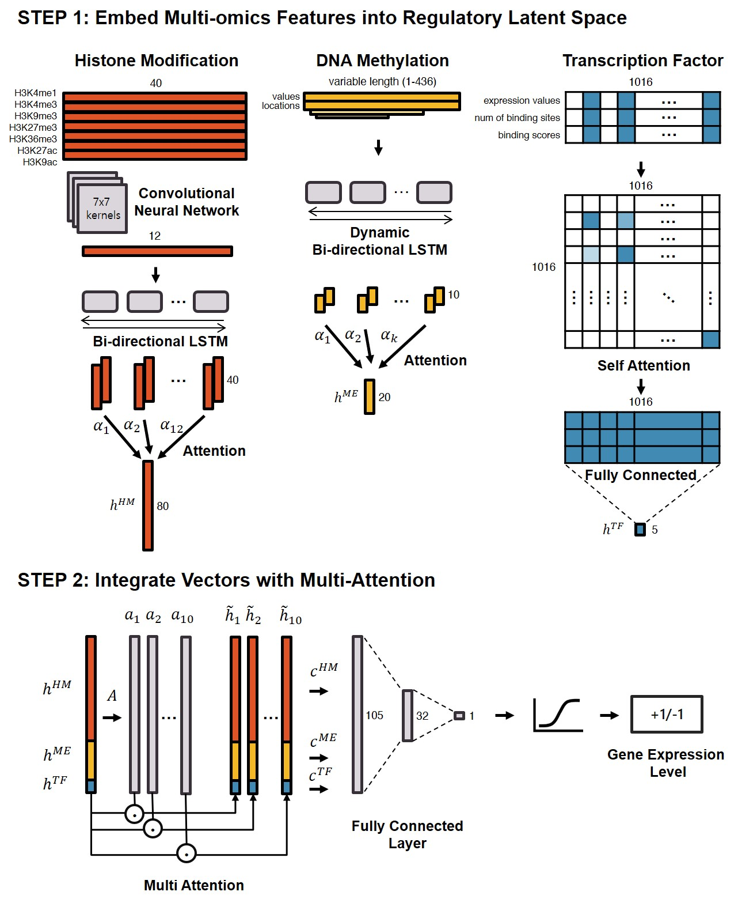
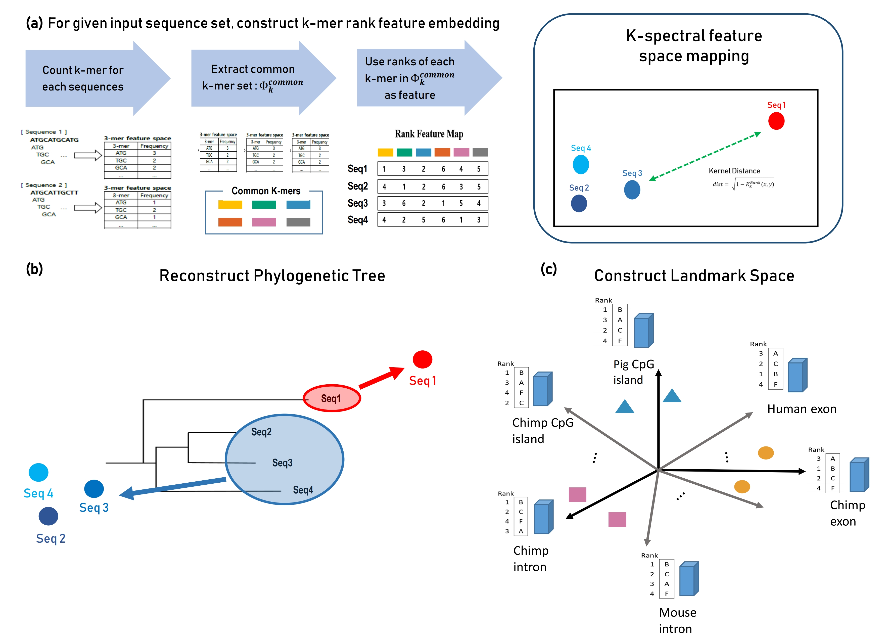
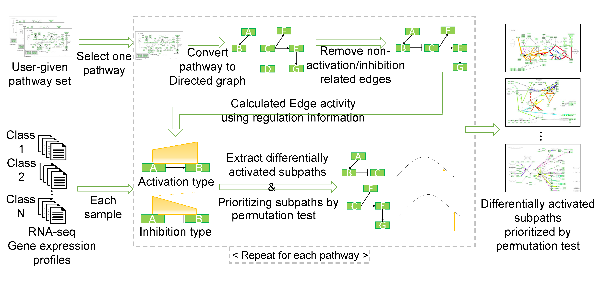
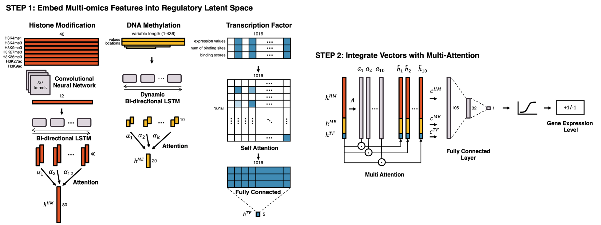

<!--

-->

<!--

-->

<!--
> ## Epigenetic Gene Regulation Model

The Multi-Attention based Deep Learning model aims to learn regulatory latent space of epigenetic/transcriptional markers such as histone modifications, methylations, and transcription factors.
* Embedding different epigenetic/transcriptional markers into a regulatory latent space using marker-specific architectures such as CNN & RNN with attention (histone modification), RNN with attention (methylation), self-attention network (transcription factor).
* Integrating each latent feature by multi-attention block to interpret relationships between multiple regulatory features.
* In experiments with 18 cell lines, the proposed model predicted the gene expression level more accurately than the state-of-the-art model.
* Reveal the cell-type-specific gene regulation mechanisms and enriched genes in terms of their functions and epigenetic regulation.

> ## Pathway Attention Model

The pathway attention model is an explainable deep learning model for predicting cancer subtypes using gene expression data and biological pathways.
* Capturing localized gene expression patterns in pathways by graph convolutional networks (GCNs)
* Reproducing biological mechanisms by combining results of GCN with multi-attention based ensemble
* Identifying transcription factors as regulator of pathways to elucidate subtype-specific biological functions from network propagation algorithm

> ## RKSS Kernel

RKSS kernel aims to measure similarity of DNA sequences in terms of evolutionary distance.
* Extension of the k-spectrum string kernel by utilizing two features for comparative and evolutionary sequence comparison
* Building a common k-mers template "landmark" to mimic common ancestors and reduce features
* Using rank information instead of frequency of k-mers to robust outliers
* Relatively well reconstruct phylogenetic trees of 10 mammalian species on three genomic regions (exon, intron, CpG island)
* Landmark space that is constructed using RKSS kernel effectively represents the genetic properties of the three regions: Order of three regions in terms of evolutionary information (exon > CpG island > intron)

> ## MIDAS

MIDAS determines condition specific subpaths, each of which has different activities across multiple phenotypes.
* Utilizing explicit gene expression quantity information from RNA-seq data
* Addressing subpath mining problem on multi-class by adopting statistical approaches
* Using a greedy subpath extension method with exponentially increasing criteria to mining complex interaction of genes
-->

> # Deep Learning models for interpreting biological data with prior knowledge

## Cancer subtype classification and modeling by pathway attention and propagation

- Designing a pathway-based explainable deep learning model by graph convolutional network and attention mechanism
- Predicting cancer subtypes using gene expression data and pathway information
- [Paper accepted by <em>Bioinformatics</em> journal](https://academic.oup.com/bioinformatics/article/36/12/3818/5811233)
  
## Learning Cell-Type-Specific Gene Regulation Mechanisms by Multi-Attention Based Deep Learning with Regulatory Latent Space

- Designing multi-modal deep learning model for learning gene regulation mechanism
- Elucidating epigenetic gene regulation mechanism by various attention layers
- [Paper accepted by <em>Frontiers in Genetics</em> journal](https://www.frontiersin.org/journals/genetics/articles/10.3389/fgene.2020.00869/full)
  
## Multi-layered Knowledge Graph Neural Network Reveals Pathway-level Agreement of Three Breast Cancer Multi-gene Assays

- Designing an explainable deep learning model by integrating intra- and inter- pathway level attention
- Identification of shared regulatory mechanisms of three breast cancer multi-gene assays 
- Under review in SCIE journal

  

> # AI with graph structured data in biomedical domains

## Sparse Structure Learning via Graph Neural Networks for Inductive Document Classification

- A novel GNN-based sparse structure learning model for inductive document classification 
- Employing structure learning to sparsely select edges between words by considering dynamic contextual dependencies
- [Paper accepted by <em>AAAI 2022</em>](https://arxiv.org/abs/2112.06386)

## Biomedical knowledge graph learning for drug repurposing by extending guilt-by-association to multiple layers

- A semantic multi-layer guilt-by-association approach that leverages the principle of guilt-by-association - “similar genes share similar functions" at the drug-gene-disease level
- Designing a semantic information-guided random walk to generate embeddings of drugs and disease in a unified embedding space
- [Paper accepted by <em>Nature Communications</em> journal](https://www.nature.com/articles/s41467-023-39301-y)

  

> # Cheminformatics and AI in Drug discovery

## Multi-Task Informed Learnable Prototypes on Few Shot learning for Molecular Property Prediction

- Leveraging shared knowledge across multiple molecular properties in few-shot learning
- Incorporating a stochastic attention mechanisms to reflect information from multiple assays
- Under review in International Conference

## Dual Representation Learning for Predicting Drug-side Effect Frequency using Protein Target Information

- Utilizing heterogenous features of drugs and side effects to get improved latent representations
- Compensating for the drugs without clear target proteins using the Adaboost method
- [Paper accepted by <em>IEEE Journal of Biomedical and Health Informatics</em> journal](https://ieeexplore.ieee.org/document/10381882)

## Improved drug response prediction by drug target data integration via network-based profiling

- A novel model-agnostic framework to enhance performances of existing deep learning models for drug response prediction 
- Network-based estimation of gene perturbation by drug treatment
- [Paper accepted by <em>Briefings in Bioinformatics</em> journal](https://academic.oup.com/bib/article/24/2/bbad034/7031154) 

  
